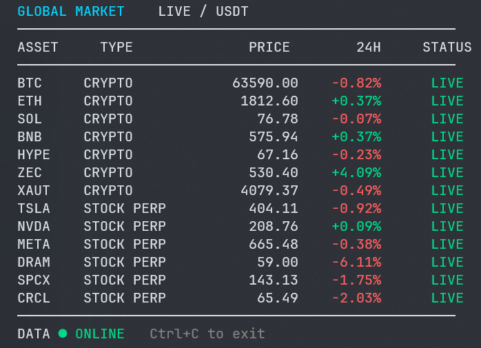

# Crypto Market Terminal

一个使用 C++23 编写的实时市场行情终端，支持 Windows 和 Linux。程序通过公开 HTTPS 行情接口并发接入 Binance 和 OKX，每个资产只展示一份最终行情；主数据源不可用或过期时自动使用备用数据源。

## 运行效果



## 特性

- Binance 与 OKX 双数据源约 1 秒刷新，界面不暴露重复平台列
- BTC、ETH、SOL、BNB、HYPE、ZEC、XAUT 现货行情
- TSLA、NVDA、META、DRAM、SPCX、CRCL 股票永续合约行情
- 自动重试、请求超时和数据过期提示
- 备用屏幕原位刷新，不污染终端历史、不产生滚屏
- 多线程回调下的线程安全行情快照
- CMake 自动下载开源依赖，无需 API Key

## 构建

需要 CMake 3.25+ 和支持 C++23 的编译器。Windows 网络层使用系统自带的 WinHTTP；Linux 网络层使用 libcurl。

### Windows

```powershell
cmake -S . -B build -G "MinGW Makefiles" -DCMAKE_BUILD_TYPE=Release
cmake --build build --config Release -j
```

### Ubuntu / Debian

```bash
sudo apt-get install cmake ninja-build g++ libcurl4-openssl-dev
cmake -S . -B build -G Ninja -DCMAKE_BUILD_TYPE=Release
cmake --build build -j
```

## 运行

```powershell
.\build\crypto-market-terminal.exe
```

Linux：

```bash
./build/crypto-market-terminal
```

按 `Ctrl+C` 平稳退出。行情仅供展示，不构成投资建议。
